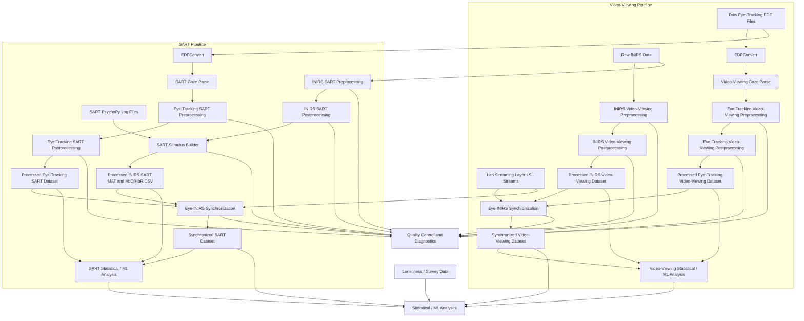

# Eye-tracking-Loneliness-Mindwandering-ELM-
This repository serves as the central data storage and sharing platform for the Eye-tracking, Loneliness, and Mind-Wandering (ELM) project, supporting collaboration among researchers at the University of Southern California (USC) and Ohio State University (OSU). The project investigates whether loneliness is associated with idiosyncratic patterns of neural processing, visual attention, and various subjective states during naturalistic  and experimental tasks. The repository contains processed fNIRS, eye-tracking, behavioral, and self-report survey datasets. Although the primary stakeholders are USC and OSU researchers working on the ELM project, the repository is publicly available to facilitate transparency, reproducibility, and secondary analyses by the broader scientific community.

## Dataset Overview
### fNIRS Video-Viewing  Dataset
* Description: Processed fNIRS recordings collected during naturalistic video viewing tasks.
* Format: CSV
* Update Frequency: Static
* Size: ~1.7 GB

### fNIRS SART Dataset
* Description: Processed fNIRS recordings collected during the Sustained Attention to Response Task (SART).
* Format: MATLAB (.mat) & CSV
* Update Frequency: Static
* Size: ~1.3 GB

### Eye-Tracking Video-Viewing  Dataset
* Description: Processed eye-tracking recordings collected during naturalistic video viewing tasks.
* Format: Gzip-compressed CSV (.csv.gz)
* Update Frequency: Static
* Size: ~2.95 GB

### Eye-Tracking SART Dataset
* Description: Processed eye-tracking recordings collected during the Sustained Attention to Response Task (SART).
* Format: Gzip-compressed CSV (.csv.gz)
* Update Frequency: Static
* Size: ~1 GB

### Synchronized Video-Viewing Dataset
* Description: Time-aligned processed eye-tracking and fNIRS datasets from the video-viewing task, synchronized using Lab Streaming Layer (LSL) streams recorded during data acquisition. Outputs include aligned multimodal signals prepared for integrated eye-tracking–fNIRS analyses.
* Format: CSV
* Update Frequency: Static
* Size: ~1.45 GB

### Synchronized SART Dataset
* Description: Time-aligned processed eye-tracking and fNIRS datasets from the SART task, synchronized using Lab Streaming Layer (LSL) streams and PsychoPy SART logs recorded during data acquisition. Outputs include aligned multimodal signals prepared for integrated eye-tracking–fNIRS analyses and SART trials/probe timing.
* Format: CSV
* Update Frequency: Static
* Size: ~550 MB

## Repository Structure
```text
├── data/
│   ├── raw/                          # Original eye-tracking, fNIRS, and LSL/PsychoPy logs
│   ├── processed/                    # Processed datasets for downstream analyses
│   │   ├── eye_processed_videos/
│   │   ├── eye_processed_SART/
│   │   ├── fNIRS_processed_videos/
│   │   ├── fNIRS_processed_SART/
│   │   ├── eye_sync_fNIRS_videos/
│   │   └── eye_sync_fNIRS_SART/
│   └── qc/                           # Quality-control reports and preprocessing summaries
│
├── docs/                             # Documentation, protocols, and data dictionaries
├── scripts/                          # R and MATLAB preprocessing/analysis pipelines
├── .gitignore
└── README.md
```


## Data Pipeline & Architecture
Use this version in your README:



