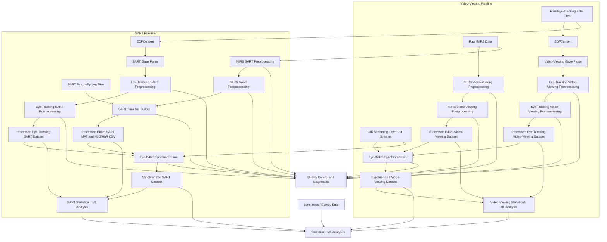

```mermaid
flowchart TD

A[Raw fNIRS Data]
B[Raw Eye-Tracking EDF Files]
C[Loneliness / Survey Data]
D[Lab Streaming Layer LSL Streams]
E[SART PsychoPy Log Files]

QC[Quality Control and Diagnostics]
OUT[Statistical / ML Analyses]

subgraph VV[Video-Viewing Pipeline]
    direction TB
    A --> VV1[fNIRS Video-Viewing Preprocessing]
    VV1 --> VV2[fNIRS Video-Viewing Postprocessing]
    VV2 --> VV3[Processed fNIRS Video-Viewing Dataset]

    B --> VV4[EDFConvert]
    VV4 --> VV5[Video-Viewing Gaze Parse]
    VV5 --> VV6[Eye-Tracking Video-Viewing Preprocessing]
    VV6 --> VV7[Eye-Tracking Video-Viewing Postprocessing]
    VV7 --> VV8[Processed Eye-Tracking Video-Viewing Dataset]

    D --> VV9[Eye-fNIRS Synchronization]
    VV3 --> VV9
    VV8 --> VV9
    VV9 --> VV10[Synchronized Video-Viewing Dataset]

    VV3 --> VV11[Video-Viewing Statistical / ML Analysis]
    VV8 --> VV11
    VV10 --> VV11
end

subgraph SART[SART Pipeline]
    direction TB
    A --> S1[fNIRS SART Preprocessing]
    S1 --> S2[fNIRS SART Postprocessing]
    S2 --> S3[SART Stimulus Builder]
    E --> S3
    S3 --> S4[Processed fNIRS SART MAT and HbO/HbR CSV]

    B --> S5[EDFConvert]
    S5 --> S6[SART Gaze Parse]
    S6 --> S7[Eye-Tracking SART Preprocessing]
    S7 --> S8[Eye-Tracking SART Postprocessing]
    S8 --> S9[Processed Eye-Tracking SART Dataset]

    D --> S10[Eye-fNIRS Synchronization]
    S4 --> S10
    S9 --> S10
    S10 --> S11[Synchronized SART Dataset]

    S4 --> S12[SART Statistical / ML Analysis]
    S9 --> S12
    S11 --> S12
end

C --> OUT
VV10 --> OUT
VV11 --> OUT
S11 --> OUT
S12 --> OUT

VV1 --> QC
VV2 --> QC
VV6 --> QC
VV7 --> QC
VV9 --> QC
S1 --> QC
S2 --> QC
S7 --> QC
S8 --> QC
S10 --> QC
S3 --> QC
```
